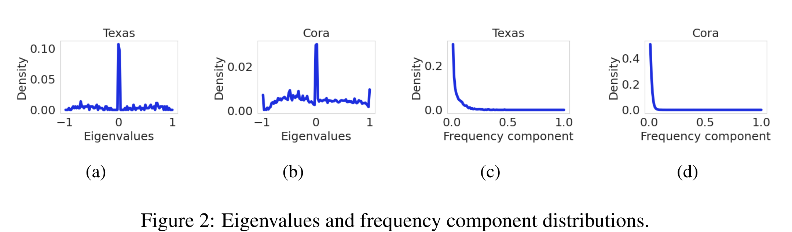
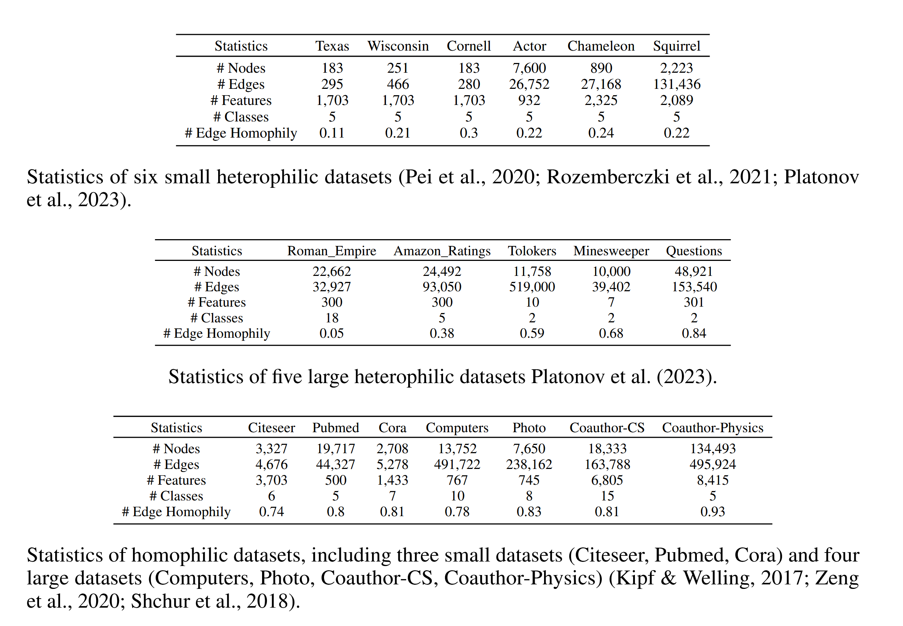
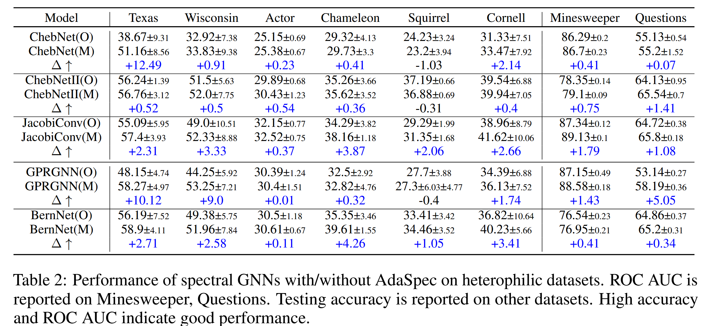
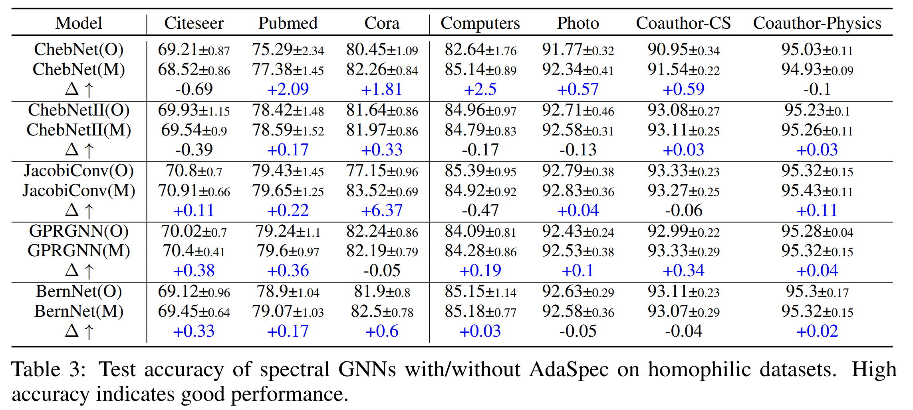
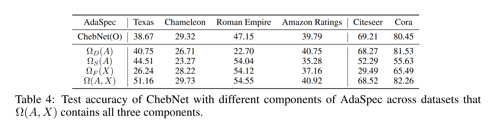
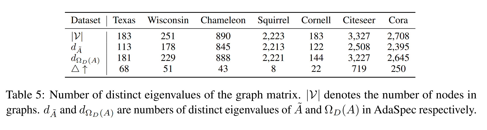

## Information
1. Authors: Fangbing Liu & Qing Wang, The Australian National University
2. 2026 ICLR
3. [https://github.com/Mia-321/AdaSpec](https://github.com/Mia-321/AdaSpec)
4. Conclusion：设计了三个模块，首先给设计一个可学习的偏置矩阵解决特征值重复的问题，然后基于此将整个特征值的分布整体平移，以减少特征值为0的部分对图信号的抑制，而后通过将特征矩阵中的信息引入到邻接矩阵中，将特征和拓扑进行对齐
    - 有意思的地方在于这篇论文处理的都是**原始邻接矩阵**，而非图拉普拉斯矩阵，也没有添加 self-loop
    - 主要贡献点还是提出了 Node Distinguishability 的相关理论证明，和 JacobiConv 中的部分比起来更加详细一点

## Abstract
1. Spectral GNNs 中的**node distinguishability** 不够透明
    - 本文探索图矩阵和节点特征如何一起影响节点的可区分度
    - 可区分的节点数目的理论下界由两个因素一起决定：不同的特征值和节点特征的非零频率部件
2. AdaSpec：
    - 不增加计算复杂度的情况下的自适应图矩阵生成模块
    - 证明其可以保留置换不变性

## 1 Introduction
1. Node distinguishability： GNN 将拓扑/特征上不同的节点映射到不同的 embedding 的能力
2. AdaSpec：
    - plug-in
    - 保留置换不变性（$\textcolor{red}{为什么需要这个性质，主要由于理论上不完备吗}$）
    - 保证图的连通性：学习到的表征能反映 the underlying graph structure

## 3 Preliminaries
1. Structurally equivalent: 两个节点拥有完全相同的邻居，$s_u\sim s_v$，交换这两个节点不会引起图邻接关系发生变化
2. $G$ 的所有自同构映射构成自同构群 $Aut(G)$
3. **Definition 3.1 Permutation Equivalence：** $f(\pi(G))=\pi(f(G))$ 

## 4 Node Distinguishability of Spectral GNNs
1. **Definition 4.1 Node Distinguishability：** $f(G)_v \neq f(G)_u \text{for all } v,u\in G, v\nsim u,$ 即只有两个节点不是同构点，则表征不相同
2. **Definition 4.2 Spectrum and Frequency Components：** $M=U\Lambda U^T\in \mathbb R^{n\times n}$，$M$ 的 spectrum 为特征值的 multiset： $spec(M)=\{\{\lambda_1,...,\lambda_n\}\}， \lambda_i=\Lambda_{ii}, d_M=|supp(spec(M))|$为不同的特征值的个数，给定节点特征 $X\in \mathbb R^{n\times h}$，其基于特征基 $M$ 的频率组件为 $\hat X = U^T X,\hat X_i=u^T_iX$为第 $i$ 个频率组件，非零组件的个数为 $||\hat X^{(M)}||_0=|\{\hat X_i | \hat X_i \neq 0_h\}| $
3. **Theorem 4.3** 对于非零的特征矩阵，至少存在一个可以区分最少 $min(d_M, ||\hat X^{(M)}||_0)$ 个节点的谱域GNN $\Psi(M,X)$
4. **Observation I (Eigenvalues of Multiplicity.)** 归一化图拉普拉斯矩阵存在重复特征值，且特征值 0 拥有最大的简并度，产生原因：
    - 图对称
    - 重复的子结构
    - 实际图中部分节点度很小，图本身的高度稀疏化也会导致图拉普拉斯矩阵的秩降低，进而产生特征值 0 的大量重复
5. **Observation II (Missing Frequency Components.)** 对于归一化图拉普拉斯矩阵的特征基来说，图信号（节点特征）存在许多缺失的频率组件
    - 图信号的获取往往和图拓扑结构不相关，因此两者的对齐程度很低
    - 现实世界的节点特征通常是平滑的或振荡的，仅包含低频或高频分量，导致许多其他分量为零或可以忽略不计。
    - 非零特征维度 $k$ 往往远小于 $n$，因此投影到特征基后，每个维度都以 $O(k/\sqrt n)$ 进行放缩，非零频率分量的比例趋向于零

## 5 AdaSpec
1. 使用 AdaSpec 增强的谱域 GNN： $\Psi^+(A,X)=g_{\theta}(\Omega(A,X))f_W(X)$
    - $\Omega$ 将 $A,X$ 映射到一个新的图矩阵$\textcolor{red}{会带来恐怖的计算成本吗}$
    - 为了保证生成的矩阵 $M=\Omega(A,X)$ 依然满足节点嵌入的置换不变性：
        - $P_{\sigma}M = MP_{\sigma},\forall \sigma \in Aut(G),P_{\sigma}$ 为对应的置换矩阵
        - $M$ 依然保留原始的图连通性
    - $\Omega(A,X)=\Omega_D(A) + \alpha_1\Omega_S(A)+\alpha_2\Omega_F(X)$
        - $\Omega_D(A)$ 用于增加不同的特征值的个数
        - $\Omega_S(A)$ 用于降低特征值 0 的简并度——降低图的洗漱程度
        - $\Omega_F(X)$ 用于减少特征矩阵缺失的频率组件
## 5.1 Increase Distinct Eigenvalues
1. $\Omega_D(A)=(D+B)^{-1/2}(A+B)(D+B)^{-1/2}, B=diag(b)$ 为可学习的非负对角矩阵，初始化为 $1/D_{uu}$
    - 初始化保留置换不变性——置换不改变节点度，因此不会变化
    - 对于结构等价但是特征不同的节点，可以学习不同的偏置量来打破结构特征性，同时降低特征的简并度
    - $B$ 修改了 self-loop 的权重，调整了节点自身信息的重要程度
2. **Theorem 5.1 (Increased Distinct Eigenvalues)** $d_{\Omega_D(A)} \geq d_{\hat A}$
    - 对于任意 $A$，都存在一个偏置对角矩阵 $B$，使得 $\Omega_D(A)$存在 $n$ 个不同的特征值
## 5.2 Shift Eigenvalues from Zero
1. 零特征值的存在迫使频谱滤波器抑制相关的频率分量，从而阻碍节点的可区分性。$\Omega_S(A)=I$
    - 添加 identity matrix 可以保留原有的特征向量，同时修改特征值，带来最小的变化
    - $\textcolor{red}{将原有的在 0 附近的高峰进行了平移，似乎等同于直接给滤波器函数添加偏置量？5.1 中偏置会带来特征向量的变化}$
## 5.3 Increase Frequency Components
1. $\Omega_F(X)=\sum_{i=1}^h \frac{X_{:i}X_{:i}^T}{||X_{:i}||_F^2}\circ A$
    - $\frac{X_{:i}X_{:i}^T}{||X_{:i}||_F^2}$ 为归一化的外积，其$(p,q)$元素表示点 $i$ 在维度 $p,q$ 上的协同贡献
2. **Theorem 5.2 (Non-Decreasing Frequency Components).** 对于没有重复特征值的实对称矩阵$C\in \mathbb R^{n\times n}$，记其正交基为 $\{u_r\}_{r\in [n]}$,基于 Condition 5.3, 有 $||\hat X_{:i}^{(C+\epsilon \Omega_F)}||_0 > ||\hat X_{:i}^{(C)}||$
3. **Condition 5.3 (Non-zero feature projections).** 对于 $C$，存在两列节点特征向量 $X_{:i}, X_{:l},i\neq l$ 以及索引 $k,j\in[n]$，使得 $u^T_kX_{:i}\neq 0,u^T_kX_{:l}\neq 0,u^T_jX_{:l}\neq 0,$
    - 也就是节点特征在某些特征向量上有非零投影
    - 即使特征稀疏，节点特征的自然异质性使得不同的节点很可能在特征向量上具有不同的非零投影。此外，虽然存在特征相关性，但现实世界的图通常在某些维度上变化很大，满足我们的非零投影条件。
4. 附录里有很大的篇幅在证明 $\Omega_F(X)$ 对于缺失的频率组件的应对能力以及 Section 5 中理论的证明

## 6 Experiments
1. Datasets: 
    - six small heterophilic graphs (Texas, Wisconsin, Actor, Chameleon-filtered, Squirrel-filtered, Cornell)
    - five large heterophilic graphs (Roman_Empire, Amazon_Ratings, Minesweeper, Tolokers, Questions)
    - seven homophilic graphs (Citeseer, Pubmed, Cora, Computers, Photo, Coauthor-CS, Coauthor-Physics)
    
2. Baselines: ChebNet, GPRGNN, BernNet, JacobiConv, ChebNetII
3. Results:

4. Ablation : $\textcolor{red}{要是有俩俩结合的部分就更好了}$

5. $\Omega_D$ 对于特征值重复的改变效果：
