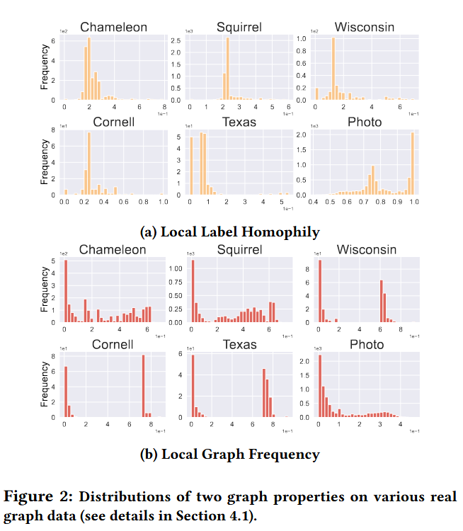
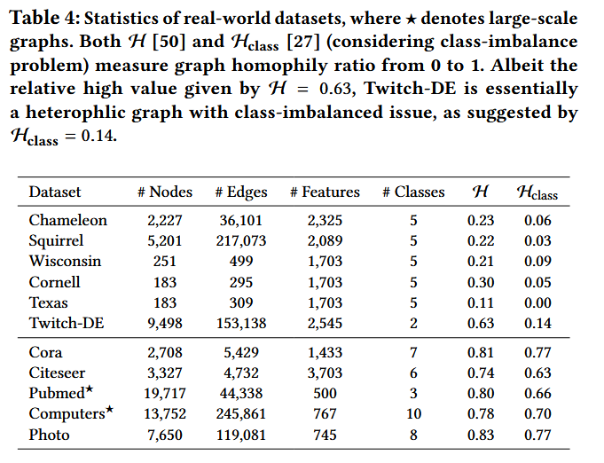
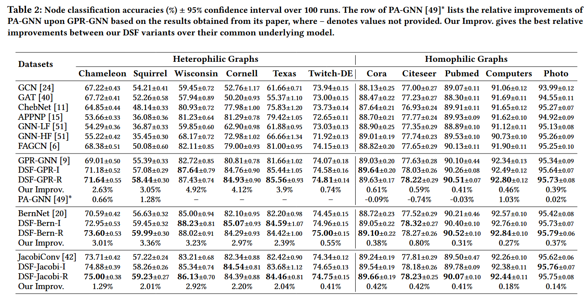
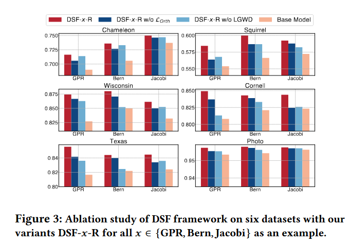
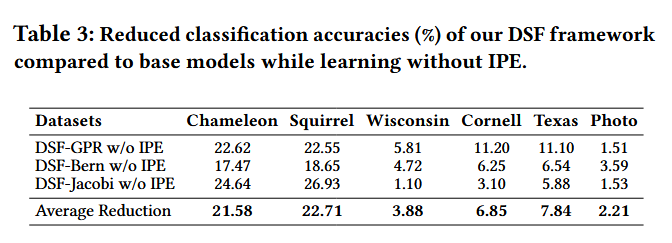

## Information
1. Jingwei Guo(University of Liverpool), Kaizhu Huang(Duke Kunshan University)
2. 2023 WWW
3. [https://github.com/jingweio/DSF](https://github.com/jingweio/DSF)
4. Conclusion: 首先通过取值范围将节点的 local graph frequency 和 global graph frequency 之间建立联系，即能够通过一个$(0,1)$ 之间的参数进行关联，具体实现方面，对于每个节点学习一个基于全图特征值的权重系数，并将其分解为全局分量和局部分量的乘积，全局分量跨节点共享，通过任务损失直接优化，局部分量由位置嵌入$P$经非线性映射得到，捕捉节点的局部结构信息,每个多项式阶都有一个节点‑特化的权重 $\beta_{k,i}$, 它是全局强度与局部缩放的乘积。

## Abstract
1. 现有方法的问题：无法处理复杂的图数据，全局谱滤波器设置偏向于 homogeneous，忽略了局部的 heterogeneity
2. 解决： Diverse Spectral Filtering(DSF) framework: 学习 node-specific 的滤波器权重
    - global weight： 所有节点共享
    - local weight：随**边**发生变化，反映图不同区域中的节点的区别
    - 设计了一个新的优化问题来辅助学习不同的滤波器

## 1 Introduction
1. 真实图结构往往具有 heterogeneous mixing pattern，如图不同的部分的 local assortative level（即局部的同配水平） 各不相同，因此使用单个全局共享的滤波器权重会产生 biased model，可能只能捕获**最通用**的图模式
2. 为每个节点使用单独的可训练的滤波器权重会导致高昂的**计算成本**，同时会对局部的噪声产生严重的**过拟合**问题
3. 合适的设计应该为全局共享模型，局部为每个节点添加和其在**图中位置**相关的自适应项
    - 相邻的节点由于邻居存在重合因此 local context 倾向于相同
    - 距离较远的节点拥有更多的可能性：如相隔遥远但同在图边缘的节点也会具有相似的 local context
4. 方法：
    - 首先编码图中节点的位置信息
    - 基于位置信息学习节点特定系数调整原始滤波器权重————以保留某些有益的 invariant graph properties（$\textcolor{red}{比如有哪些呢}$）
    - 可以兼顾共性和特性，同时提供可解释性（$\textcolor{red}{好突然的可解释性}$），框架易于实现且 plug-and-play

## 2 Related Work
1. In particular, Suresh et al. [38] introduced a node-level assortativity to show heterogeneous mixing patterns inherent in real-world graphs. However, these existing works mostly tackle this regional heterogeneity phenomenon under the intuitive message passing framework [16].
    - [38] Susheel Suresh, Vinith Budde, Jennifer Neville, Pan Li, and Jianzhu Ma. 2021. Breaking the limit of graph neural networks by improving the assortativity of graphs with local mixing patterns. Proceedings of the 27th ACM SIGKDD Conference on Knowledge Discovery & Data Mining (2021).
    - [16] Justin Gilmer, Samuel S Schoenholz, Patrick F Riley, Oriol Vinyals, and George E Dahl. 2017. Neural message passing for quantum chemistry. In International conference on machine learning. PMLR, 1263–1272.
2. It is noted that a recent proposal [49] shares some similarity with our work. This method takes the idea of dynamic neural networks [19], and introduce PA-GNN based on GPR-GNN [9] by learning node-specific weight offsets.We note that PA-GNN [49] also extract latent positional embeddings from the graph structure, which however cannot be better changed/adjusted to tasks and is mixed with other (even incompatible) attributes. **结构信息和特征信息**的兼容较差
    - [49] Yuxin Yang, Yitao Liang, and Muhan Zhang. [n. d.]. PA-GNN: Parameter-adaptive graph neural networks. ([n. d.]).
    - [19] Yizeng Han, Gao Huang, Shiji Song, Le Yang, Honghui Wang, and Yulin Wang. 2021. Dynamic neural networks: A survey. IEEE Transactions on Pattern Analysis and Machine Intelligence (2021).
## 3 Notations and Preliminaries
1. $\mathcal N_{i,k}: $ $i$ 的 $k$ 跳邻域
2. 本文使用 edge homophily ratio，即一条边的两个端点是同一类的比例

## 4 Methodology
1. Local Graph Frequency: $\lambda_{n,i} = \sum_{(v_p,v_q)\in E_{i,k}} \Bigl(\frac{1}{\sqrt{\deg_p}}u_{n,p} - \frac{1}{\sqrt{\deg_q}}u_{n,q}\Bigr)^2 $
    -  由于局部子图的边集合是全图边集合的子集，且每一项都是非负的，局部频率必然不超过全局频率。
    - 通过 $\xi_i = \lambda_{n,i}/\lambda_n$ 可以把两者关联起来，且在常规的 $k$-hop 邻域情形下 $\xi_i$ 落在 ((0,1)) 区间。
    - **局部的信息可以由某个(0,1)之间的参数和全局信息的组合进行表达**
    

2. 谱域 GNN 模型通过对图拉普拉斯矩阵的特征值应用滤波器，在“谱域”中进行操作。传统上，谱GNN通过将图拉普拉斯矩阵$\hat{L}$的多项式应用于节点特征$X$来聚合邻域信息：
$
Z = \sum_{k=0}^K \alpha_k P_k(\hat{L})X$ 
在这个标准公式中，滤波器权重$\alpha_k$是标量值。关键是，这些权重在整个图的每个节点之间共享。这种方法被称为**同质谱滤波**。虽然它在计算上高效，并且对“同质图”（连接的节点倾向于共享相似属性的图）有效，但它施加了一个显著的约束。它假设底层图结构是均匀的，并且单一的滤波逻辑适用于网络的每个区域。

3. 这项研究通过引入 **多样化谱滤波DSF**框架来解决这个瓶颈。核心思想是从一组共享权重转向节点特定的滤波器权重。DSF框架不是使用标量$\alpha_k$，而是为每个多项式阶数$k$的每个节点$v_i$分配一个唯一的系数$\beta_{k,i}$。该操作可以表示为：
$
Z = \sum_{k=0}^K \text{diag}(\beta_{k,1}, \beta_{k,2}, \dots, \beta_{k,N}) P_k(\hat{L})X
$
这里，$\text{diag}(\dots)$创建一个对角矩阵，其中每个条目对应于特定节点的滤波器权重。这使得网络能够局部调整其信号处理行为。例如，同质邻域中的节点可能使用强调低频信号的权重，而异质邻域中的节点可能适应捕捉高频分量。
这种方法的一个直接挑战是参数爆炸。如果图有$N$个节点，滤波器阶数为$K$，则模型需要学习$N \times (K+1)$个参数。对于大型图，这不仅计算成本高昂，还会导致严重的过拟合，因为模型可能简单地记住每个节点局部邻域中的噪声。为了解决这个问题，作者提出了一种通过**迭代位置编码**（**IPE**）和局部和**全局权重分解**（**LGWD**）生成这些权重的原则性方法。
    - 迭代位置编码（IPE）
为了管理模型复杂性，DSF框架不直接学习权重$\beta_{k,i}$。相反，它假设**结构位置相似**的节点应该具有相似的滤波器权重。该框架使用位置嵌入来捕获这些结构角色。
此过程始于初始位置编码$X_p$，例如拉普拉斯或随机游走嵌入，它们已知能捕捉全局和局部图几何。这些编码通过一个目标函数$L_p$进行细化，该函数旨在确保嵌入在图上平滑同时保持独特性：
$
L_p = \|X_p - P\|_F^2 + \kappa_1 \text{tr}(P^T \hat{L} P) + \kappa_2 \|P^T P - I_d\|_F^2
$
在这个损失函数中，第一项使嵌入$P$保持接近初始值。第二项（拉普拉斯正则化）确保相邻节点具有相似的嵌入。第三项（正交性约束）确保嵌入空间的不同维度提供非冗余信息。
为了高效地解决这个问题，作者推导了一个迭代更新规则，允许嵌入演化：
$
P^{(k+1)} = \eta_1 X_p + (1 - \eta_1) [(1 + \eta_2) \hat{A} - \eta_2 \sigma(P^{(k)} W P^{(k+1)})] P^{(k)}
$
通过使用这些经过细化的位置嵌入$P_i$作为小型共享神经网络映射的输入，模型可以生成节点特定的权重$\beta_{k,i}$，而无需为每个节点单独设置参数。
    - 平衡全局和局部信息：LGWD。虽然节点特异性适应功能强大，但捕捉整个图共享的普遍特征仍然有益。DSF框架通过**局部和全局权重分解（LGWD）**实现这种平衡。每个节点特定的权重$\beta_{k,i}$被分解为两部分：
$
\beta_{k,i} = \gamma_k \theta_{k,i} = \gamma_k \sigma_p(W^{(k)T} P_i^{(k)} + b^{(k)})
$
(1) 全局分量（$\gamma_k$）： 跨所有节点共享的权重，捕捉整体图属性。
(2) 局部分量（$\theta_{k,i}$）： 来源于位置嵌入$P_i$的节点特定缩放因子。映射函数$\sigma_p$通常是非线性激活函数，如Tanh，允许局部分量重新缩放甚至翻转全局权重的符号。
这种分解确保了模型在保持标准谱GNN的泛化能力的同时，获得了根据局部结构需求进行调整的灵活性。
4. 实现变体：DSF-x-I 和 DSF-x-R
该框架被设计为一个“即插即用”模块，可以集成到现有的谱GNN中，如GPR-GNN、BernNet或JacobiConv（由$x$表示）。作者提出了两种主要变体，基于它们在训练期间如何处理正交性约束：
    - DSF-x-I (迭代式)： 该变体在迭代更新步骤中严格执行位置嵌入的正交性。虽然理论上严谨，但对于大型图来说计算量可能很大，因为它涉及与节点数量呈二次方增长的操作。
    - DSF-x-R (正则化)： 该变体效率更高。它不是在每一步都强制执行正交性，而是在最终任务损失中添加一个正交性惩罚$L_{Orth}$：$
L = L_{task} + \lambda_{Orth} L_{Orth}
$
其中惩罚定义为：
$
L_{Orth} = \|P^{(K)T} P^{(K)} - I_d\|_F^2
$ DSF-x-R变体被发现对于大规模应用更实用，并且由于正则化方法的灵活性，通常能实现更好的性能。

5. 方法设计和理论架构之间的简化：
    - 用全局特征值的比例来近似局部频率：
        - 理论：局部频率 (\lambda_{n,i}) 本应通过 子图拉普拉斯分解 直接计算。
        - 简化：论文把 (\lambda_{n,i}) 近似为 (\xi_i \lambda_n)，其中 (\xi_i) 是在 迭代位置编码（IPE） 中学习到的标量。
        - 好处：避免了对每个节点重新做特征值分解，显著降低了 (O(N^2)) 的计算开销。
    -  省略高阶正交约束
        - 理论：在目标函数中加入 (|P^{\top}P - I_d|_F^2) 以保证位置嵌入的正交性。
        - 简化：在 DSF‑x‑R 变体中直接 去掉该项，改用一个 正交正则化 (\lambda_{\text{Orth}}L_{\text{Orth}})。
        - 好处：进一步削减了 (O(N^2)) 的复杂度，使模型在大规模图上更易训练。
    - 统一的非线性映射
        - 理论：可以为每个多项式阶数 (\kappa) 设计不同的映射函数来生成节点特定的滤波系数 (\beta_{\kappa,i})。
        - 简化：论文采用 单一的 sigmoid 映射（Eq. 7）
$ \beta_{\kappa,i}= \sigma_p\bigl(W^{(\kappa)\top}P^{(k)}_i + b^{(\kappa)}\bigr) $
只需要学习 $W^{(\kappa)}$ 与 $b^{(\kappa)}$ 两组参数。
        - 好处：显著降低了可训练参数数量，从 $\mathcal{O}(N\cdot K)$降到 $\mathcal{O}(d\cdot K))（(d\ll N)$，减轻了过拟合风险。
    - 低维位置嵌入空间
        - 理论：位置向量 $P$ 可以是与特征维度相同的高维向量。
        - 简化：在实现中先把原始位置特征 $X^{(p)}$ 映射到低维空间（维度 $d$），再在该空间上进行迭代更新（Eq. 6）。
        - 好处：降低了矩阵乘法的成本，同时保持了位置编码的表达能力。
    - 固定多项式阶数与超参数
        - 理论：多项式阶数 $K$ 与其它超参数（如 $\eta_1,\eta_2$）可以灵活调节。
        - 简化：实验统一使用 $K=10$，并在 $\eta_2=0$ 的情况下跑 DSF‑x‑R，仅在 $\eta_1$ 上进行网格搜索。
        - 好处：简化了超参数搜索空间，提升了可重复性。
    - 只保留关键的正交正则化
        - 理论：完整的目标函数包含 位置重构误差、拉普拉斯平滑项、以及 正交约束 三部分。
        - 简化：在 DSF‑x‑R 中仅保留 任务损失 + 正交正则化，省略了位置重构误差项。
        - 好处：进一步削减了梯度计算量，使训练过程更快且更稳定。
    - 采用统一的迭代更新公式
        - 理论：位置编码的更新可以采用多种优化器或自适应步长。
        - 简化：实现中固定使用 梯度下降 并在每一步后 tanh 激活，保持更新公式简洁统一（Eq. 6）。

## 5 Experiments
### 5.1 Datasets

### 5.2 Results

### 5.3 Ablation study 

