## Information
1. Authors: Xiyuan Wang(Peking University), Muhan Zhang(Peking University, Beijing Institute for General Artificial Intelligence)
2. 2022 ICML
3. [https://github.com/GraphPKU/JacobiConv](https://github.com/GraphPKU/JacobiConv)
4. 总体来说引入 Jacobi basis 的作用似乎是三个模块里最大的，虽然声称使用正交基回带来收敛速度的提升，但实际的训练时间和每个epoch时间都有上升，

## Abstract
1. 无须非线性变换，谱域GNN可以输出任意图信号，且在满足两个条件的情况下可以具备多样性——即可以表示任意函数：
    - 图拉普拉斯矩阵没有重复特征值
    - 节点特征没有缺失的频率成分
2. 构建了谱域 GNN 表达能力和图同构检测的关联
3. 实验部分：从优化的角度比较了具有相同表达能力的不同谱域 GNN 能力的表现————提出使用正交基，权重函数与图信号在谱域的密度相关
4. JacobiConv: 使用正交且灵活的 Jacobi 基应对在大范围内变化的权重函数，同时舍弃了非线性变换的部分并实现了很好的效果

## 1 Introduction
1. 现有谱域 GNN 的主要区别在于谱滤波器的选取上，但是仍存在以下问题：
    - 不同谱滤波器的优劣势在哪里，如何选取
    - 谱域 GNN 前后的 MLP 层是否有用，单独使用谱域 GNN 是否足够
    - 不同谱域 GNN 有相同的表达能力，但是不同的实验表现
2. 本文结论：
    - 线性 GNN 在满足 mild conditions 之后具备通用性
    - 非线性对于谱域 GNN 实现高表达能力来说并不是必不可少的（有实验佐证）
    - 从图同构检测角度分析了谱域 GNN 的通用条件，构建了谱域和空域 GNN 表达能力之间的联系
    - 分析不同谱域 GNN 的优化过程，通过检查线性谱域 GNN 在 global minimum 附近的 Hessian matrix，发现使用正交基+图信号密度作为权重函数收敛最快
    - 设计了新的 Polynomial Coefficient Decomposition(PCD)技术增强滤波器的优化

## 2 Preliminaries
1. 矩阵的 condition number: $\kappa(M)=\frac{\lambda_{max}}{\lambda_{min}}$，若 $M$ 为奇异矩阵，则 $\kappa(M)=+\infty$
2. 归一化拉普拉斯矩阵：$\hat L=I-\hat A = U\Lambda U^T,U$为特征向量矩阵
### 2.1 Graph Isomorphism
 自同构的阶：$min_k \pi^k=e,k=1,2,...,e$ 为 identity mapping，即要连续施加多少次当前映射使得节点排序可以回到最初状态
### 2.2 Graph Signal Filter and Spectral GNNs
1. 图傅里叶变换：$\tilde X = U^TX$，逆变换为 $X=U\tilde X$
2. $U$ 的第 $i$ 列为特征值$\lambda_i$对应的 frequency component, $\tilde X_{\lambda}=U^T_{:\lambda}X$为 $X$ 在频率 $\lambda$ 处的 frequency component，若该值不为 0 则说 $X$ 包含该频率成分，否则为缺失该频率成分
3. spectral filter: 
    - $Ug(\Lambda)U^TX =\sum_{k=0}^K \alpha_kU\Lambda^kU^TX=\sum_{k=0}^K \alpha_k\tilde L^kX=g(\tilde L)X$, 
    - $g(\lambda):=\sum_{k=0}^K \alpha_k\lambda^k$,
    - $g(\tilde L)=\sum_{k=0}^K\alpha_k\tilde L^k$
    - 现有谱域 GNN 的一般形式 $Z=\phi(g(\tilde L)\varphi(X))$
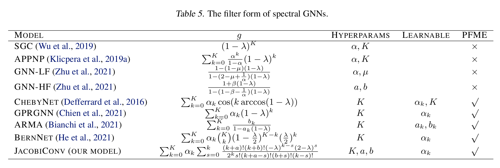
4. 若谱域 GNN 可以表达任意多项式滤波器函数$g$,则称为 Polynomial-Filter-Most-Expressive(PFME) GNNs
    - Filter-Most-Expressive(FME) GNNs：可以表达任意的实值滤波器函数
5. **Definition 2.1 Linear GNN:** $Z=g(\tilde L)XW$, $g,W$ 分别为可学习的实值多项式和矩阵 
    - 线性 GNN 保留了谱域 GNN 的基本形式，其表达能力为一般谱域 GNN 的 **lower bound**
    - **Proposition 2.2:** 线性 GNN 满足 PFME，若$\phi, \varphi$可以表达所有的线性函数，则谱域 GNNs 可以区分所有线性 GNNs 能区分的节点对
6. 任务场景：**节点属性预测任务**
7. 假定存在任意实值滤波器函数需要你和，尽管 PFME GNNs 只能表达多项式滤波器函数，由于特征值 $\lambda$ 是离散变量，可以通过某个插值多项式拟合该任意滤波器函数
    - $\textcolor{red}{会出现所谓的 runge 现象吗}$
    - 本文中 PFME GNNs 即为 FME GNNs
    - 假定线性 GNNs 均有足够大的 K 值

## 3 Related Work
### 3.1 Spectral GNNs
1. GPRGNN 和 ChebyNet 为 PFME
2. BernNet 只能表达正值多项式滤波器函数——限制是为了模型的正则化，分析表达能力的时候可以不考虑
### 3.2 Removing Nonlinearity from GNNs
1. 现有方法主要是为了提高模型的 scalability，滤波器较为受限，本文旨在分析线性 GNNs 的表达能力和优化属性，同时拟合任意多项式滤波器函数
### 3.3 Expressive Power of GNNs
1. 本文为谱 GNN 提供了逼近任何函数的条件，并讨论了这些条件与图同构之间的关系。

## 4. Expressive Power of Linear GNNs
1. 线性 GNNs 的两个组件：
    - **Linear Transformation W：** 由于 $XW=U(\tilde XW)$，因此空域上的线性变换同时也是频域上的线性变换
    - **Filter $g(\tilde L)$:**$g(\tilde L)X=U(g(\Lambda)\tilde X)$，频域上，滤波器将 $\lambda$对应的$\tilde X$的频率成分放缩 $g(\lambda)$倍
2. **Theorem 4.1(Universality Theorem):** 若$\tilde L$ 没有重复的特征值且节点特征$X$ 没有确实的频率成分，则线性 GNNs 可以拟合任意的一维预测，即共有三个条件：
    - 一维预测
    - 无重复特征值
    - 无缺失频率成分
### 4.1 Multidimensional Prediction
1. **Proposition 4.2** 若节点特征矩阵 $X$ 不满秩，对于所有的 $k>1$和所有图，均存在某个 k 维预测结果是线性 GNNs 无法生成的
    - 可以为不同的输出通道选择不同的多项式系数
### 4.2 Multiple Eigenvalue
1. 重复特征值会导致相同的 $g(\lambda)$，导致对频率成分的处理也会相同
### 4.3 Missing Frequency Components
1. 滤波器只能进行放缩，对于 0 无论怎么处理都是 0,
2. 重复特征值和频率成分缺失在实际图中都较为少见
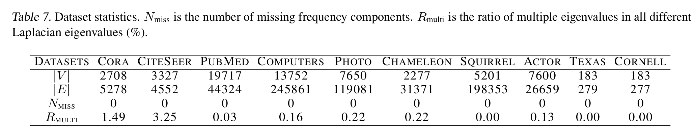
### 4.4 Connection to Graph Isomorphism
1. **Proposition 4.3** 给定滤波器函数为 $K$ 阶多项式的线性 GNN，记其对于节点 $i$ 的预测为 $LG_K(i)$，记$WL_k(i)$ 为 $k-WL$对该节点的输出结果，节点的初始标签为其特征向量$X_i$，则有，对于任意节点对 $i,j$，若 $WL_{K+1}(i)=WL_{K+1}(j)$，$LG_K(i)=LG_K(j)$ 
    - $\textcolor{red}{这里为啥是 1-WL，呢，线性 GNNs 没有限定 K 的大小吧}$
2. **Corollary 4.4** 若图中没有缺失的频率成分，归一化拉普拉斯矩阵也没有重复的特征值，则 1-WL 可以区分图中所有的非同构节点
3. **Theorem 4.5** 对于归一化拉普拉斯矩阵没有重复特征值的图，其自同构的阶小于3
    - 对称程度高（自同构阶在3或者以上）的图有更多重复的特征值
    - 实际场景中的图往往高度不规则，因此出现重复特征值的概率较小
4. **Theorem 4.6** 若给定图的归一化拉普拉斯矩阵没有重复特征值，节点特征没有缺失的频率成分，则该图除了 identity mapping 外没有其他的自同构映射
    - $\textcolor{blue}{首先证明可以区分所有的非自同构节点，然后证明满足条件的图里没有自同构节点，故 1-WL 可以区分符合条件的图里的所有节点}$
    - $\textcolor{red}{这算不算一种有点理想化的假设呢}$
    - Theorem 4.1 的三个条件将问题的复杂程度限定在 1-WL 可以解决的范围之内了，也就是说仅从这个角度来看，1-WL 和其他可以区分所有节点的方法是同等效果的，因此可以讲 1-WL 可以为线性 GNNs 的能力画一个能力边界
    - 1-WL 此前更多是为空域 GNNs 进行表达能力的支撑，文中提出将线性 GNNs 和 1-WL 进行关联也相当于在表达能力层面将谱域 GNNs 和空域 GNNs 关联起来了
### 4.5 Role of Nonlinearity
1. 对 $X$ 施加空域上的激活函数 $\sigma$ 对应到谱域上：$\sigma'(X)=U^T\sigma(U\tilde X)$
    - 谱域节点特征转换成空域特征后添加非线性处理后再转换成谱域信号输出
    - 在空域上是非线性的操作，对应到谱域上会先将不同频率的信号进行混合，然后进行非线性变换再重新分布到每个频率上
    - 不同频率信号的混合可以缓解重复特征值和频率成分缺失的问题，但是也不足以彻底解决这些问题，毕竟空域 GNNs 的能力上限依然是 1-WL
    - 文中认为由于 Theorem 4.1 的三个条件很好满足，因此在实验中舍弃了非线性
### 4.6 Role of Bias
1. 线性层的 Bias 项相当于每个特征拼接一个全 1 向量然后维持线性变换的形式
2. 结论：引入偏置并不能帮助补全图中缺失的频率成分

## 5. Choice of Basis for Polynomial Filters
1. 给定多个输出通道，其中第 l 个通道对应的滤波器参数为：
    - $Z_{:l}=\sum_{k=0}^K \alpha_{kl}g_k(\hat L)XW_{:l}$
    - 所有完备的多项式基都能构建 PFME 模型
    - $g_{:l}(\hat L)=\sum_{k=0}^K \alpha_{kl}g_k(\hat L)$

### 5.1 Hessian Matrix and Polynomial Basis
1. Loss function: square loss $R=\frac{1}{2}||Z-Y||^2_F$
2. 假定模型可以收敛到全局最优，旨在研究全局最优附近的收敛速度
3. 文中假定所有模型都能收敛到全局最优，也就是说不同的基最后都会学到相同的滤波器函数（$\textcolor{green}{还能这样}$）
    - Loss 对于 W 的梯度如图，因此和选择的基无关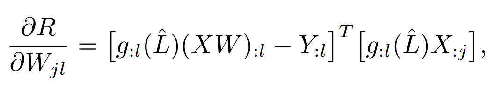
4. 对于 $\alpha$ 的分析:
    - 目标是求 $\partial^{2}R/(\partial\alpha_{k_{1}}\partial\alpha_{k_{2}})$，即 **Hessian 矩阵** $H$ 的元素。
    - 把 $R$ 看成 $\alpha$ 的二次函数，固定其他参数（$W$）不变。记 $\Phi(\alpha) = \sum_{k}\alpha_{k}\,g_{k}(\hat L)XW .$则$R = \tfrac12\|\Phi(\alpha)-Y\|_{F}^{2}.$，对 $\alpha_{k_{1}}$ 求梯度：$\frac{\partial R}{\partial\alpha_{k_{1}}}
    = \bigl(\Phi(\alpha)-Y\bigr)^{'T}
        \frac{\partial\Phi}{\partial\alpha_{k_{1}}}
    = \bigl(\Phi(\alpha)-Y\bigr)^{'T}
        g_{k_{1}}(\hat L)XW .$，再对 $\alpha_{k_{2}}$ 求导，得到 Hessian 元素
    $\frac{\partial^{2}R}{\partial\alpha_{k_{1}}\partial\alpha_{k_{2}}}
    = \bigl[g_{k_{2}}(\hat L)XW\bigr]^{'T}
    \bigl[g_{k_{1}}(\hat L)XW\bigr].$，因为 $W$ 只是一层线性映射，把它合并进 $X$，记 $X' = XW$。于是变成
    $\boxed{\displaystyle
    \frac{\partial^{2}R}{\partial\alpha_{k_{1}}\partial\alpha_{k_{2}}}
    = X'^{'T} g_{k_{2}}(\hat L)^{'T} g_{k_{1}}(\hat L)\,X' } .$,由于 $g_{k}(\hat L)$ 是对称矩阵（多项式函数的对称拉普拉斯），$g_{k}^{'T}=g_{k}$，于是$\frac{\partial^{2}R}{\partial\alpha_{k_{1}}\partial\alpha_{k_{2}}}
    = X'^{'T} g_{k_{2}}(\hat L) g_{k_{1}}(\hat L)\,X' .$
    - 对拉普拉斯矩阵做特征分解  
    $\hat L = U\Lambda U^{'T},\qquad
    \Lambda = \operatorname{diag}(\lambda_{1},\dots,\lambda_{n}),$则
    $g_{k}(\hat L) = U\,g_{k}(\Lambda)\,U^{'T},\qquad g_{k}(\Lambda)=\operatorname{diag}\bigl(g_{k}(\lambda_{1}),\dots,g_{k}(\lambda_{n})\bigr).$把 $X'$ 投到谱域：$\tilde X = U^{'T}XW$。于是$X'^{'T} g_{k_{2}}(\hat L) g_{k_{1}}(\hat L)X'
    = (U\tilde X)^{'T}U g_{k_{2}}(\Lambda)U^{'T}
                        U g_{k_{1}}(\Lambda)U^{'T}U\tilde X
    = \tilde X^{'T} g_{k_{2}}(\Lambda) g_{k_{1}}(\Lambda)\tilde X .$ 因为 $\Lambda$ 是对角的，乘法只在对应的特征值上进行标量相乘，得到
    $\frac{\partial^{2}R}{\partial\alpha_{k_{1}}\partial\alpha_{k_{2}}}
    = \sum_{i=1}^{n} g_{k_{2}}(\lambda_{i})\,g_{k_{1}}(\lambda_{i})\,
    \bigl(\tilde X_{\lambda_{i}}\bigr)^{2}.$这里 $\tilde X_{\lambda_{i}}$ 是第 $i$ 个频率的 **谱系数**（即 $U^{'T}XW$ 的第 $i$ 行），记作 $\tilde X_{\lambda_{i}}$。
    - 把离散求和视作 **Riemann 求和**: 定义累计幅度函数 
    $F(\lambda) = \sum_{\lambda_{i}\le \lambda}\tilde X_{\lambda_{i}}^{2},$它在每个特征值 $\lambda_{i}$ 处跳跃 $\tilde X_{\lambda_{i}}^{2}$。于是
    $\tilde X_{\lambda_{i}}^{2}
    = F(\lambda_{i})-F(\lambda_{i-1}),$其中 $\lambda_{0}$ 设为 0，$\lambda_{n+1}$ 设为 2（归一化拉普拉斯的最大特征值）。则有：
    $\frac{\partial^{2}R}{\partial\alpha_{k_{1}}\partial\alpha_{k_{2}}}
    = \sum_{i=1}^{n}
    g_{k_{2}}(\lambda_{i})\,g_{k_{1}}(\lambda_{i})\,
    \bigl[F(\lambda_{i})-F(\lambda_{i-1})\bigr].$把每一项乘以 $\dfrac{\lambda_{i}-\lambda_{i-1}}{\lambda_{i}-\lambda_{i-1}}$（即 1），得到
    $\frac{\partial^{2}R}{\partial\alpha_{k_{1}}\partial\alpha_{k_{2}}}
    = \sum_{i=1}^{n}
    g_{k_{2}}(\lambda_{i})\,g_{k_{1}}(\lambda_{i})\,
    \frac{F(\lambda_{i})-F(\lambda_{i-1})}{\lambda_{i}-\lambda_{i-1}}
    \;(\lambda_{i}-\lambda_{i-1}),$这正是 **Riemann 求和** 的形式。括号里的分数是 **频率 $\lambda$ 上的信号密度**，记为  
    $f(\lambda) = \frac{\Delta F(\lambda)}{\Delta \lambda}
                = \frac{F(\lambda_{i})-F(\lambda_{i-1})}{\lambda_{i}-\lambda_{i-1}}.$当图的节点数趋向无穷大，特征值 $\{\lambda_{i}\}$ 在区间 $[0,2]$ 上变得 **稠密**，Riemann 求和收敛到 **定积分**：
    $\boxed{\displaystyle
    H_{k_{1}k_{2}}
    = \int_{0}^{2} g_{k_{1}}(\lambda)\,g_{k_{2}}(\lambda)\,f(\lambda)\,d\lambda .
    }$这里的 **权函数** $f(\lambda)$ 正是 **图信号在频率 $\lambda$ 处的密度**，它由节点特征的谱系数决定。
    - 最小化条件数 $\kappa(H)$,Hessian 矩阵 $H$ 的 **条件数** $\kappa(H)$ 衡量它的“可逆性”。如果 $H$ 是 **单位矩阵**（所有特征值均为 1），则 $\kappa(H)=1$，是最小可能值。$H$ 为单位矩阵当且仅当多项式空间为正交空间
    $\left \langle h,g\right \rangle = \int_{0}^{2} g_{k_{1}}(\lambda)g_{k_{2}}(\lambda)f(\lambda)\,d\lambda
    = \begin{cases}
    1 & k_{1}=k_{2}\\
    0 & k_{1}\neq k_{2}
    \end{cases}$此时得到最小的条件数，梯度在所有方向上同样陡峭，学习率可以取到 ($\eta=1$)（或更大），理论上一次更新就能直接到达最优点,即最快的收敛速度。
5. 结论：尽管所有完备的多项式基都拥有相同的表达能力，但是使用正交基+图信号密度作为权重函数可以实现最快的收敛速度
    - 特征值已知的情况下，可以使用 Gram-Schmidt 过程构建正交基
    - 为了避免特征值分解的计算成本，使用更灵活的方式——Jacobi 多项式基
### 5.2 Jacobi Polynomial Bases
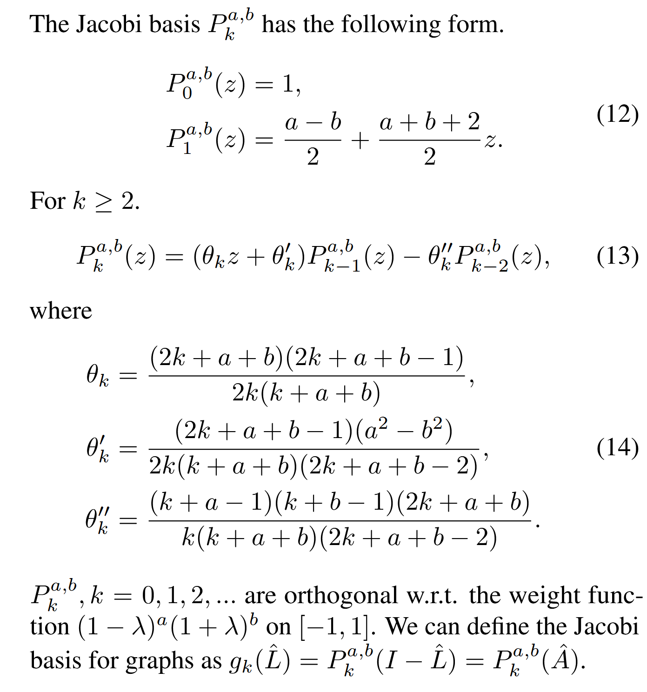
### 5.3 A Discussion on Popular Filter Bases
1. **Proposition 5.1.** 对于任意满足内积要求的权重函数来说， Monomial basis 都不是正交基
2. Chebyshev 基是 Jacobi 基对应特定权重函数时候的特例
3. Bernstein 基不是正交基，但仍然可以实现较小的条件数

## 6. JacobiConv Architecture
1. 首先将维度较大的原始特征 $X$ 通过线性层映射到维度较小的特征 $\hat X$，而后依次使用三个模块：Multiple filter functions, Jacobi basis, Polynomial coefficient decomposition
### 6.1 Multiple Filters
主要应对多通道的预测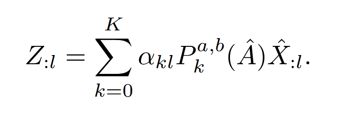
### 6.2 Computation of Jacobi Basis
在 $O(K)$ 时间内计算所有的基，并进行 K 次消息传递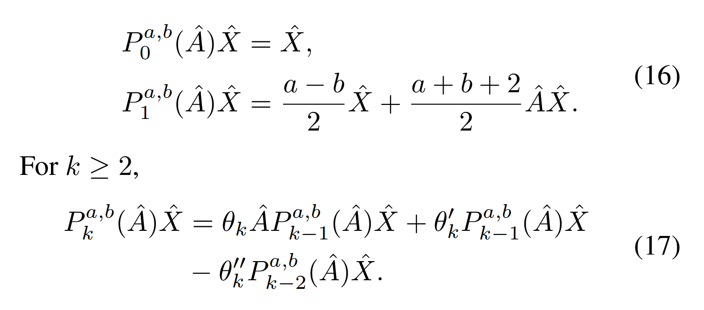
### 6.3 Polynomial Coefficient Decomposition
对于真实数据集，$\alpha_{kl}$ 随着$k$ 的增大会变小，因此会出现较大的取值范围，大大增加模型优化的难度，因此进行分解：$\alpha_{kl}=\beta_{kl}\Pi_{i=1}^k\gamma_i$,$\gamma_i$在不同的输出通道之间共享，令 $\gamma_i=\gamma' tanh \eta_i$，控制其取值范围为 $[-\eta',\eta']$，则有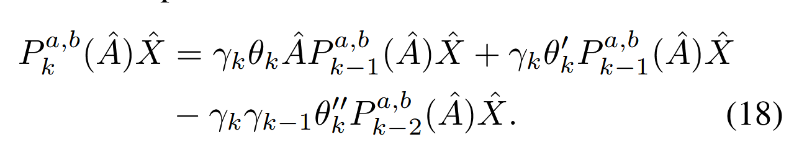
    - $\beta_{kl}$ 只在 输出层的加权求和 中出现，它在递推式里不再出现，仍然是模型参数，只是位置搬到了最后的线性组合阶段。
    - 首先通过 $\gamma$ 的取值范围控制参数的变化范围，而后使用 $\beta$进行对应调整
## 7. Experiment
### 7.1 Evaluating Models on Learning Filters
1. 收敛速度上的比较：将50张真实照片转换成 2D regular 4-neighbor grid graphs，此时移除 PCD部分
2. 分别比较了本文方法和其他方法的loss降低速度对比以及将 Jacobi 基换成其他基的情况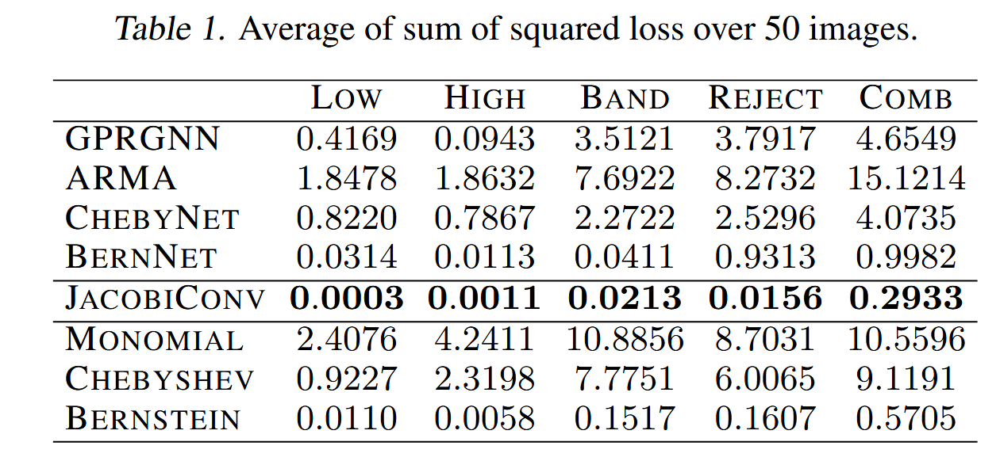
### 7.2. Evaluation on Real-World Datasets
1. Datasets:
    - Homogeneous graphs： Cora,Citeseer, PubMed, Computers, Photo
    - Heterogeneous: Chameleon, Squirrel, Actor, Texas, Cornell
    - 节点分类，6:2:2 划分
2. Baselines： GCN，APPNP, ChebyNet, GPRGNN,BernNet
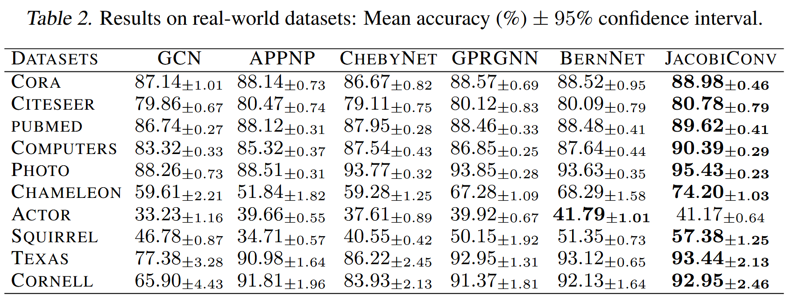
### 7.3 Ablation Analysis
1. Monomial/Chebyshev/Bernstein/Jacobi:仅使用对应的多项式基
2. UniFilter：仅使用一组滤波器函数
3. No-PCD：移除 PCD模块
4. NL: 将线性变换替换成带两层 ReLU 的 MLP
5. NL-Res:添加残差连接
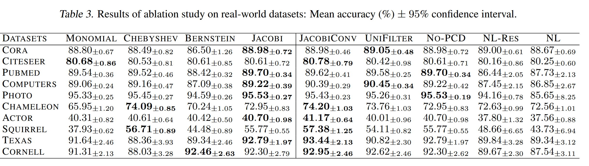
### 7.4 Scalability
1. 参数量下降，时间复杂度接近，计算复杂度：$O(Kmd)$,和APPNP以及GPRGNN相同，BernNet 为 $O(K^2md)$
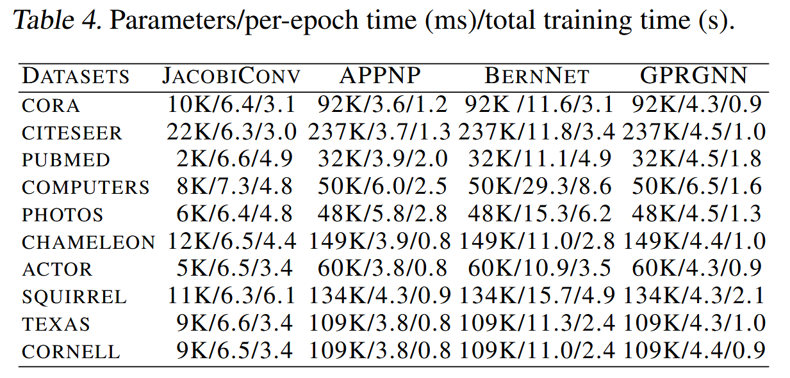

## Appendix
To be done
