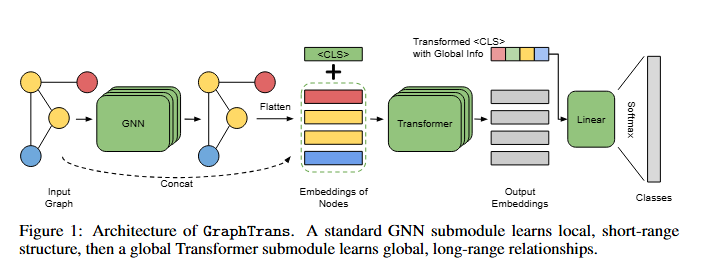
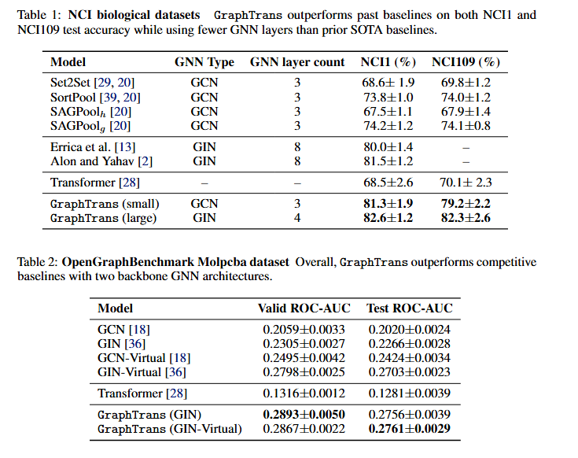
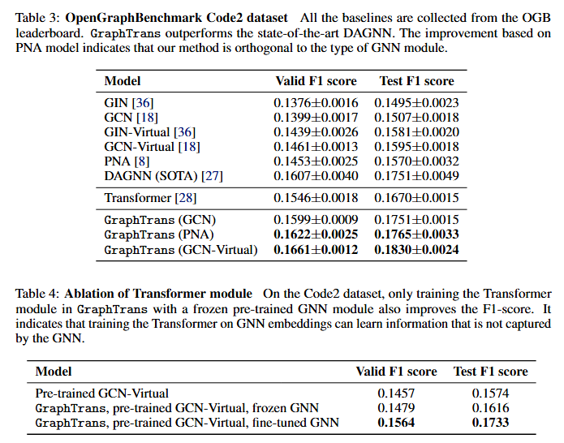
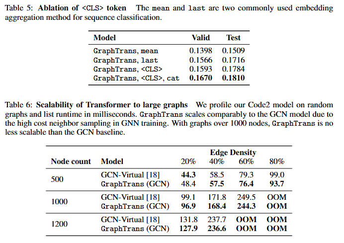
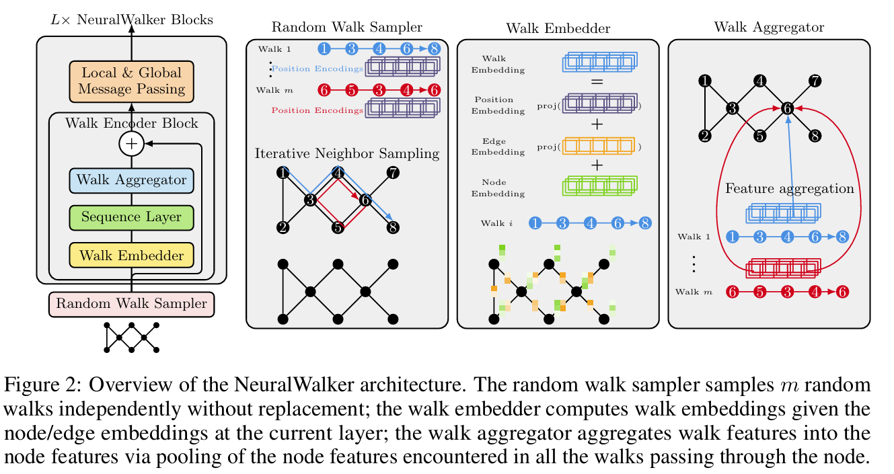
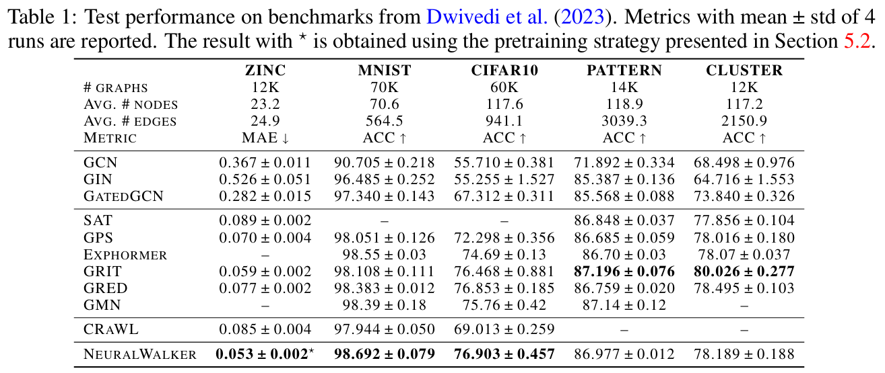
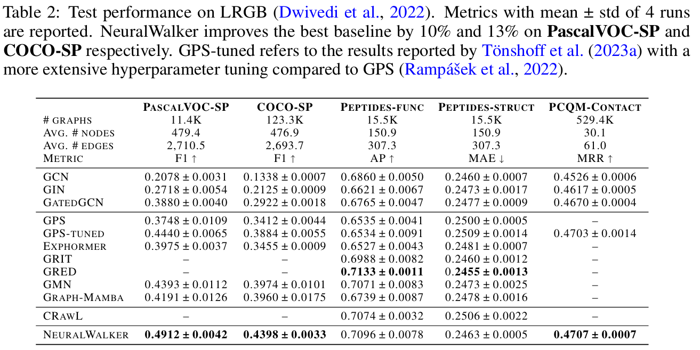
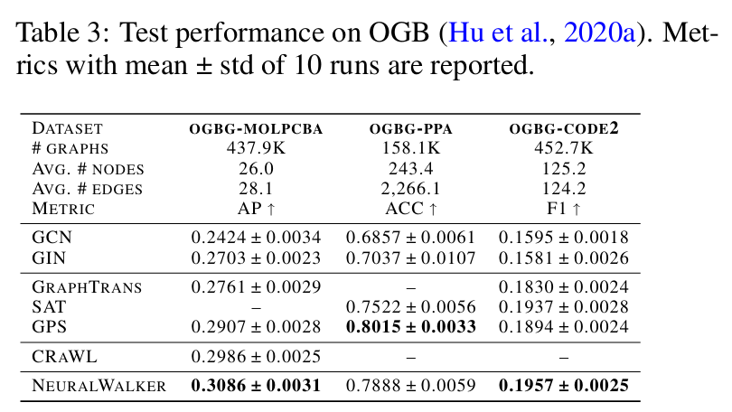
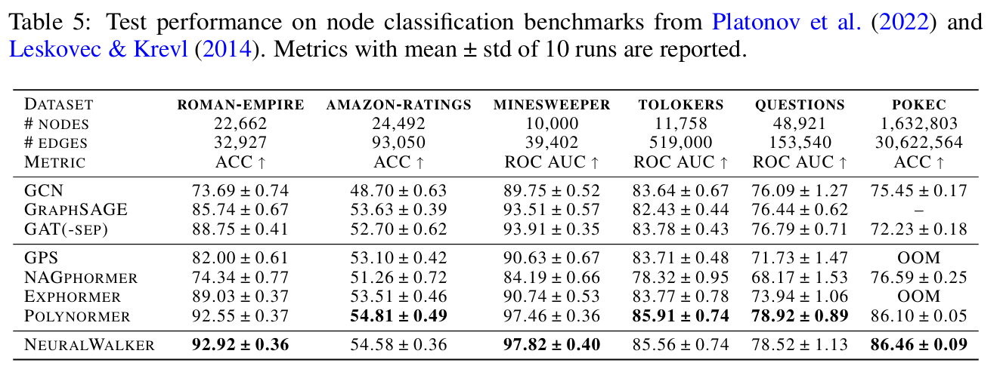
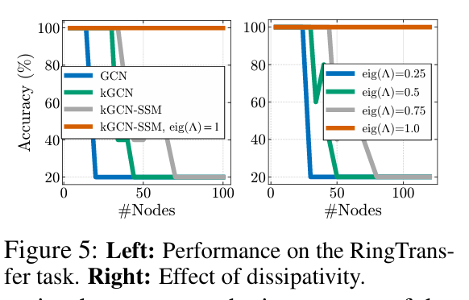

0. 长程依赖可以对应的实际场景：在社交网络中，一个用户的兴趣可能受到其几层好友的偏好驱动；在分子图中，远离的原子之间的相互作用可以决定整个化合物的药理活性；在程序抽象语法树（AST）中，函数的返回值往往取决于代码中相距甚远的语句之间的关系；在交通网络里，某条道路的拥堵情况会被远端交叉口的流量所影响。

1. 2021-Neurips-Representing long-range context for graph neural networks with global attention
    - GraphTrans [https://github.com/ucbrise/graphtrans](https://github.com/ucbrise/graphtrans)
    - 主要针对长程依赖中的优化问题，如梯度消失和过平滑，处理的时图级别的任务
    - GraphTrans：
        - GNN 子网络：生成节点聚合局部邻域之后的表征
        - Transformer 子网络：不再使用显式位置编码——GNN已经将图的结构和位置信息编码到节点嵌入中，因此直接把 GNN 产生的节点嵌入送入一个**无位置编码**的自注意力层，利用注意力矩阵在所有节点之间建立全局的配对关系。
        - 通过 $\text{<CLS>}$ Token 实现学习到的全局读出
            - 在将 GNN 产生的节点嵌入 $h_{L}^{\text{GNN}}$ 线性投影并归一化后，直接在序列的开头追加一个可学习向量 $h_{\langle\text{CLS}\rangle}$。图中只有一个 $\text{<CLS>}$  标记，它在每个图的节点序列前被插入，用作全局读出（readout）。
            - 在每一层自注意力中，$\text{<CLS>}$ 与所有节点 $v\in V$ 计算注意力权重 $\alpha_{\langle\text{CLS}\rangle,v}$，实现全图范围的聚合，学习把对当前任务最有帮助的节点信息聚合进自己的向量。
            - 最终的 $\text{<CLS>}$ 输出向量被视作图的整体表示，再经过线性投影和 softmax 产生分类或回归预测。
    - Experiments: 
        

2. 2025-ICLR-Learning long range dependencies on graphs via random walks
    - NeuralWalker [https://github.com/BorgwardtLab/NeuralWalker](https://github.com/BorgwardtLab/NeuralWalker)
    - 主要针对长程依赖引起的 oversmoothing 和 oversquashing 问题，而图Transformer通过采用全局注意力机制来缓解这些问题，使得每个节点无论距离远近都可以与任何其他节点通信。虽然GTs在建模长程交互方面是有效的，但它们通常将图视为节点的集合，依赖辅助的位置或结构编码来保留拓扑。这可能导致图原始连接中固有的丰富、多尺度结构信息的丢失。
        - 提出将**广度优先**的消息传递和**深度优先**的随机游走进行结合
        - 处理图级别和节点级别的任务，理论上较为完备
    - NeuralWalker: 
        - 随机游走采样: 模型采样$m$条长度为$\ell$的非回溯随机游走。优先选择非回溯游走是因为它们避免立即返回到前一个节点，迫使游走探索图中更多样化的区域。采样率$\gamma = m/n$允许模型在彻底的图覆盖和计算速度之间取得平衡(m 为采样的数量，n 为节点数)。
        - 游走嵌入和序列建模： 对于每条采样的游走$W = (w_0, \dots, w_{\ell})$，游走嵌入器将节点和边的序列转换为高维向量序列$h_W$。包含：
            - 当前节点特征$h_V(w_i)$， 
            - 投影后的边特征$h_E(w_i, w_{i+1})$，
            - 描述游走内部连接的位置编码，
                - 身份编码（identity encoding）在一个固定窗口 $s$ 内检查当前节点是否在之前的 $j$ 步出现过，如果出现则对应的二进制矩阵元素为 1，否则为 0。识别“同一节点的**多次出现**”，这对捕获图中的环、重复模式非常关键
                - 邻接编码（adjacency encoding）在同样的窗口内检查当前节点与之前的 $j$ 步的节点之间是否存在边，如果存在则对应矩阵元素为 1，否则为 0。提供“**是否相邻**”的信息，使模型能够感知在游走过程中节点之间的直接连通性。
            - 在每个位置 $i$ 的最终 walk embedding $h_W[i]$ 由以下三项相加得到：$$
                h_W[i] = h_V(w_i) \;+\; \text{proj}_{\text{edge}}\bigl(h_E(w_i,w_{i+1})\bigr) \;+\; \text{proj}_{\text{pe}}\bigl(h_{\text{pe}}[i]\bigr)
                $$
            - 游走序列由序列层进行处理。虽然可以使用1D CNN和Transformer，但作者发现状态空间模型——特别是Mamba——非常有效。Mamba的选择性状态空间机制使其能够高效地捕获长序列中的依赖关系，使其成为处理长随机游走中包含的结构信息的理想选择。
        - 聚合和局部消息传递： 在序列层更新游走特征后，一个游走聚合器将这些特征映射回各个节点。对于任何节点 $v$，其更新后的表示 $h_{agg\_V}$ 是所有经过 $v$ 的游走中所有段的特征的平均值。最后，应用一个局部消息传递步骤（例如 GIN 层），以确保节点表示也整合了直接邻域信息，从而有效地结合了“深度优先”（游走）和“广度优先”（邻居）的视角。
        - 理论优势： 
            - 对于任何游走长度 $\ell \geq 2$，NeuralWalker 的表达能力都严格高于 1-WL 测试。此外，它的表达能力高于 $(\lfloor \ell/2 \rfloor + 1)$-子图同构测试。
            - 论文使用特定的度量 $d_{F,\ell}$ 证明，NeuralWalker 的输出在图结构方面是 Lipschitz 连续的。这意味着图中微小的变化会导致模型输出的有界变化，这是鲁棒性的一个关键特性。
            - 随着采样游走数量 $m$ 的增加，平均表示 $g_{f,m,\ell}(G)$ 收敛于所有可能游走上的真实期望表示 $g_{f,\ell}$。这证明了使用采样来近似完整图结构的合理性。
    - Experiments:    
3. 2025-Neurips-On Vanishing Gradients, Over-Smoothing, and Over-Squashing in GNNs: Bridging Recurrent and Graph Learning
    - GNN-SSM
    - 贡献点：
        - GNN 与递归模型的关联：把每一层的消息传递视作时间步的状态更新，整个 GNN 就像一个 离散时间的 RNN。在这种视角下，层与层之间的 Jacobian 与 RNN 中的时间 Jacobian 相同，因而会受到 极端梯度消失 的限制。将 GNN 重写为 状态空间模型 (SSM)，即在每层加入可控制的状态转移矩阵 Λ 和输入矩阵 B，使得 Jacobian 的特征值可以被人为调到 边缘混沌 (edge‑of‑chaos)，从而保持梯度的可传递性。
        - 梯度消失导致特征坍塌：当 Jacobian 的奇异值大多数 < 1 时，层层映射会把特征向量压缩到 零点（固定点），这正是 over‑smoothing（特征过平滑）现象的本质。通过调节 Λ 的谱半径，能够 精确控制 特征收敛的速度，甚至保持特征的 norm 不变，从而避免在深层网络中出现完全相同的节点表示。
        - 与 over‑squashing 的关联：over‑squashing 表现为信息在远距离节点之间被“压缩”。论文指出，这种压缩本质上是 梯度消失 的副作用——当 Jacobian 过于收缩时，远端节点对中心节点的影响被削弱。论文主张 同时（① 进行图重连以提升拓扑连通性，② 使用 GNN‑SSM 等手段控制 Jacobian 谱，减轻梯度消失。这样既能让信息流通畅，又能保持梯度的强度。
    - 偏理论，仅记录主要架构：GNN-SSM没有使用标准的消息传递更新，而是采用了一种状态转移方程：
        - $$
        H^{(k+1)T} = \Lambda H^{(k)T} + B F_{\theta}(H^{(k)}, k)^T
        $$
        - 在这个模型中：
            $\Lambda$ 是一个状态转移矩阵，充当“记忆”。它控制着有多少信息从前一层传递过来。
            $F_{\theta}$ 是一个标准的GNN层，用于计算邻域更新。
            $B$ 是一个输入矩阵，控制着有多少新的邻域信息被注入到状态中。
        - 可以明确控制$\Lambda$的特征值。通过将$\Lambda$的特征值设置在接近“混沌边缘”（幅值接近1），模型可以在多层中保持其信号，而不会崩溃或爆炸。
    - 实验中提到了 RingTransfer 任务，即专门测试长距离信息传播的挑战
    - 远距离图基准 long-range graph benchmark (LRGB) 主要用来进行消融实验，图属性预测任务

4. 2023-Neurips-MeGraph: capturing long-range interactions by alternating local and hierarchical aggregation on multi-scaled graph hierarchy